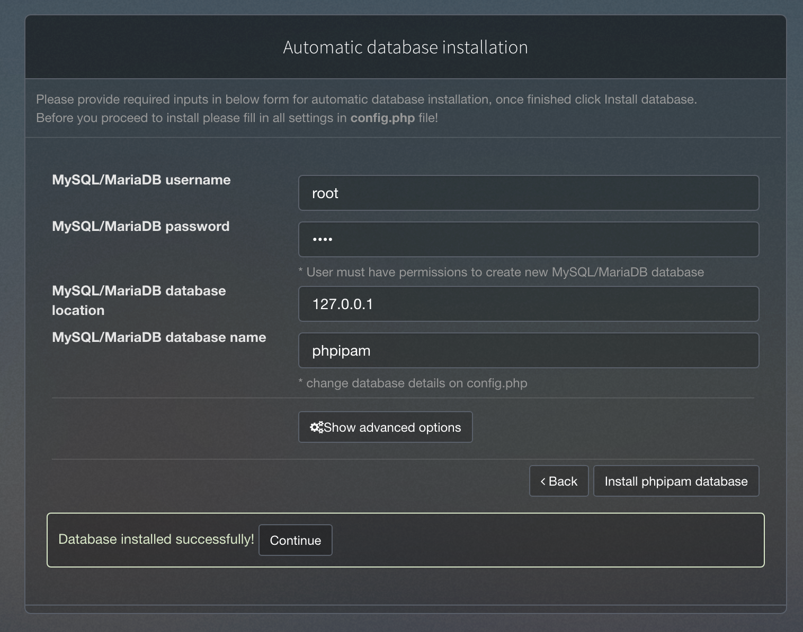

# {PHPIPAM} IP Address Management System
PhpIPAM ใช้เพื่อจัดทำเอกสาร VLAN และโครงสร้างซับเน็ตของเครือข่ายของเรา เครื่องมือนี้สามารถจัดทำเอกสารผู้ให้บริการอินเทอร์เน็ตหรือ ISP ของเรา ข้อมูลวงจรโดยละเอียด และผู้ติดต่อทั้งหมด นอกจากนี้ยังช่วยให้เรามี Firewall Zones และ routings ที่มีเอกสารครบถ้วน ข้อมูลทั้งหมดใน phpIPAM สามารถค้นหาและเข้าถึงได้ง่าย แผนกไอทีของเราใช้ phpIPAM ซึ่งต้องใช้ชื่อผู้ใช้และรหัสผ่านในการเข้าถึงข้อมูล เนื่องจากเป็นแอปพลิเคชันบนเว็บ จึงไม่จำเป็นต้องติดตั้งไคลเอ็นต์เดสก์ท็อป เครื่องมือนี้เป็นแอปที่ยอดเยี่ยมที่สามารถจัดการงานของเราได้อย่างง่ายดาย


# Download Project
```bash
$ cd ~
$ git clone https://github.com/ezynook/phpipam.git
$ cd phpipam
```
# Deploy
```bash
$ docker-compose up -d --build
```
# Database Setup
* Username: ```root```
* Password: ```root```



# Install Extension
```bash
docker exec -it phpipam \
/bin/bash -c "docker-php-ext-install <extension_name>"
```

# กำหนด Schedule เพื่อให้มีการ Update alive host อัตโนมัติ

* ```Linux (crontab)```
* ```Windows (Task Schedule)```
```bash
touch \
      ~/phpipam/updatecheck.sh \
      && chmod +x ~/phpipam/updatecheck.sh \
      && vim ~/phpipam/updatecheck.sh
```
คัดลอง Script นี้ไปวาง
```bash
#!/bin/bash

docker exec -i phpipam bash -c \
"cd /var/www/html/phpipam-agent; /usr/local/bin/php index.php update"
```
```bash
crontab -e
```
คัดลอง Script นี้ไปวาง
* สามารถกำหนดช่วงเวลาที่ต้องการให้ Update ในรูปแบบ Cron
https://crontab.guru/
```bash
*/5 * * * * bash ~/phpipam/updatecheck.sh
```

---
Author: ```Pasit Y.```

Cr. [PHPIPAM Offcial Website](https://phpipam.net/)